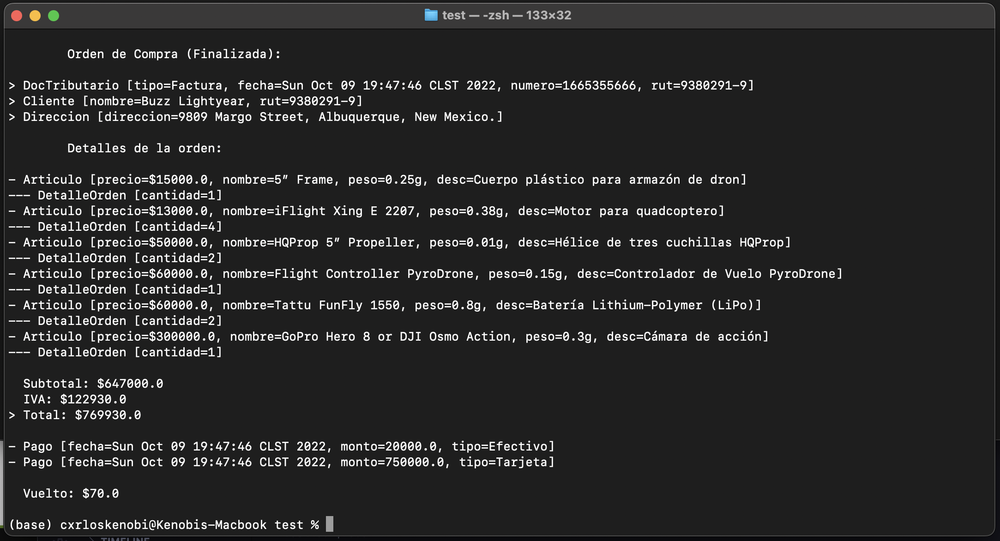

# Tarea 1 - Programación II

> ([Informática UdeC](https://fi.udec.cl/pregrado/ingenieria-civil-informatica/) 2022-2)


## UML a Código y Uso de Git

### Integrantes
- [Sebastián Benjamín Bustos Beni](https://github.com/sebasinmas)
- [Carlos Efraín Pinto Urtubia](https://github.com/CxrlosKenobi)

---
### Estructura de proyecto

El espacio de trabajo contiene las siguientes carpetas, donde:
- `src`: la carpeta para mantener el código fuente de la tarea.
- `assets`: la carpeta para mantener archivos que brindan contexto al repo.

Mientras que la sub carpeta `src.packages` contiene el siguiente árbol de carpetas nombradas semánticamente conteniendo:

- `cart`: implementación de clases relacionadas con el manejo de los productos en la orden de compra.
- `checkout`: implementación de clases relacionadas con el manejo del proceso de pago.
- `customer`: implementación de clases relacionadas con el cliente y su información.
- `order`: implementación de clases relacionadas con la orden de compra y sus detalles.


### Diagrama UML

El diagrama UML base de la tarea se encuentra en la carpeta `/assets` junto al enunciado de la tarea.


---

### Ejemplo de uso

El siguiente ejemplo muestra el flujo completo de la aplicación, desde la creación de un cliente, hasta la creación de una orden de compra y su pago.

```java
public class App {
    public static void main(String[] args) {
        Direccion direccion = new Direccion("9809 Margo Street, Albuquerque, New Mexico.");
        Cliente cliente = new Cliente("Buzz Lightyear", "9380291-9", direccion);

        Articulo art1 = new Articulo("5” Frame", "Cuerpo plástico para armazón de dron", 15000f, 0.250f);
        Articulo art2 = new Articulo("iFlight Xing E 2207", "Motor para quadcoptero", 13000f, 0.380f);
        Articulo art3 = new Articulo("HQProp 5” Propeller", "Hélice de tres cuchillas HQProp", 50000f, 0.010f);
        Articulo art4 = new Articulo("Flight Controller PyroDrone", "Controlador de Vuelo PyroDrone", 60000f, 0.150f);
        Articulo art5 = new Articulo("Tattu FunFly 1550", "Batería Lithium-Polymer (LiPo)", 60000f, 0.800f);
        Articulo art6 = new Articulo("GoPro Hero 8 or DJI Osmo Action", "Cámara de acción", 300000f, 0.300f);

        OrdenCompra fpvDrone = new OrdenCompra(cliente);

        fpvDrone.addProducto(art1, 1);
        fpvDrone.addProducto(art2, 4);
        fpvDrone.addProducto(art3, 2);
        fpvDrone.addProducto(art4, 1);
        fpvDrone.addProducto(art5, 2);
        fpvDrone.addProducto(art6, 1);

        Efectivo efectivo = new Efectivo(20000f);
        Tarjeta tarjeta = new Tarjeta(750000f, "00002", "Débito");

        fpvDrone.addPago(efectivo);
        fpvDrone.addPago(tarjeta);
        fpvDrone.finalizarOrden("Factura");

        System.out.println(fpvDrone);
    }

```

De la cual se obtiene el siguiente resultado:



