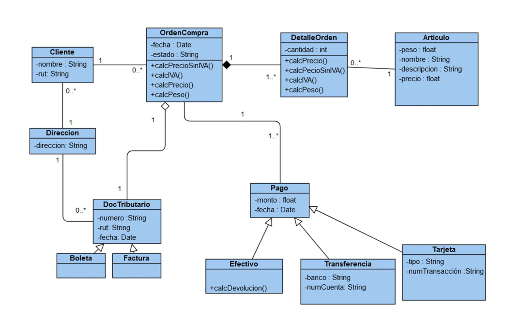

# Tarea 1 - Programación II

> ([Informática UdeC](https://fi.udec.cl/pregrado/ingenieria-civil-informatica/) 2022-2)

## UML a Código y Uso de Git

### Integrantes
- [Sebastián Benjamín Bustos Beni](https://github.com/sebasinmas)
- [Carlos Efraín Pinto Urtubia](https://github.com/CxrlosKenobi)

---
### Estructura de proyecto

El espacio de trabajo contiene las siguientes carpetas, donde:
- `src`: la carpeta para mantener el código fuente de la tarea.
- `assets`: la carpeta para mantener archivos que brindan contexto al repo.

Mientras que la sub carpeta `src.packages` contiene el siguiente árbol de carpetas nombradas semánticamente conteniendo:

- `cart`: implementación de clases relacionadas con el manejo de los productos en la orden de compra.
- `checkout`: implementación de clases relacionadas con el manejo del proceso de pago.
- `customer`: implementación de clases relacionadas con el cliente y su información.
- `order`: implementación de clases relacionadas con la orden de compra y sus detalles.

### Diagrama UML

